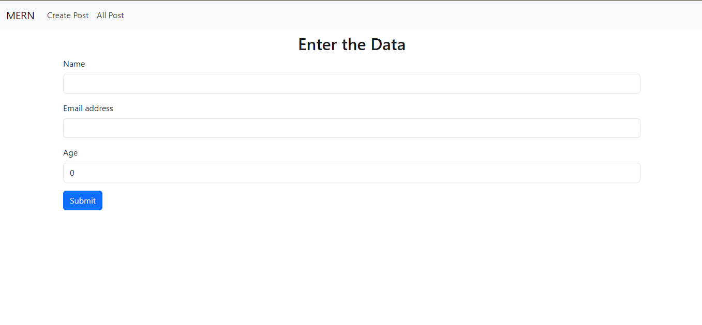
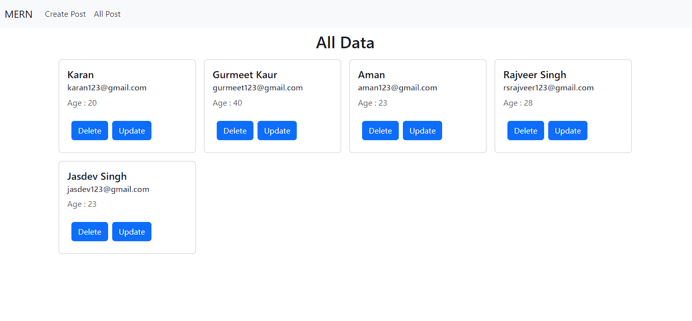
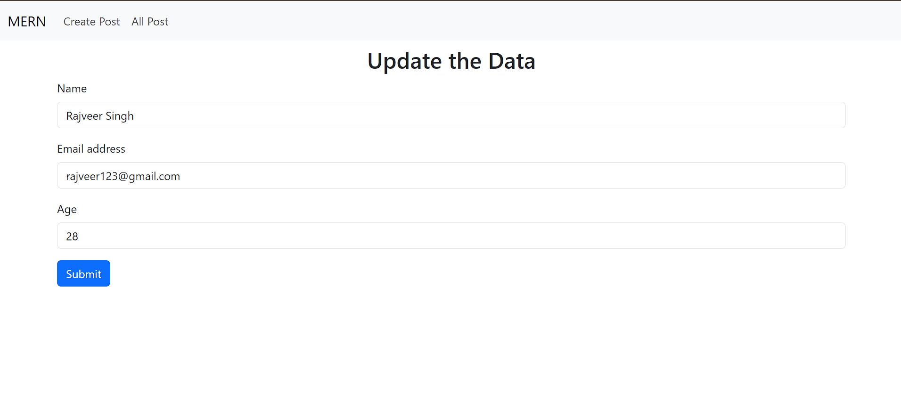
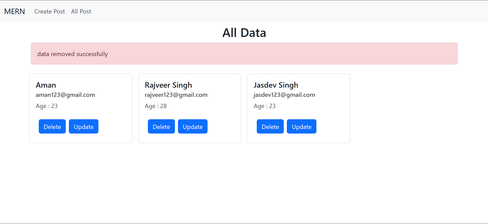

# MERN CRUD Application

## Description

This MERN (MongoDB, Express.js, React.js, Node.js) application is a simple CRUD (Create, Read, Update, Delete) system. The backend Express server provides functionality for managing user data, including the ability to add, update, and delete entries. Users can input their name, email, and age, making it a comprehensive solution for handling user information.

## Technologies Used

- **MongoDB**: A NoSQL database used to store user data.
- **Express.js**: A backend framework for building the server.
- **React.js**: A frontend library for building user interfaces.
- **Node.js**: A JavaScript runtime used for server-side development.

## Features

1. **Create (C)**: Users can add their name, email, and age to the database by sending a POST request to the server.

2. **Read (R)**: The application allows users to retrieve and view all data from the database by sending a GET request.

3. **Update (U)**: Users can update existing entries by sending a PUT request with the updated information, including name, email, and age.

4. **Delete (D)**: The application supports deleting records from the database by sending a DELETE request.

## Installation

1. Clone the repository:

   ```bash
   git clone https://github.com/your-username/your-mern-app.git
   ```

2. Navigate to the project directory:

   ```bash
   cd your-mern-app
   ```

3. Install dependencies for both the backend and frontend:

   ```bash
   # Install backend dependencies
   cd backend && npm install

   # Install frontend dependencies
   cd ../frontend && npm install
   ```

4. Configure MongoDB:

   - Create a MongoDB database and obtain the connection URI.
   - Update the backend environment file (`backend/.env`) with the MongoDB URI.

5. Configure Port:

   - Update the backend environment file (`backend/.env`) with your desired port.

6. Start the application:

   ```bash
   # Start the backend server
   cd backend && npm start

   # Start the frontend
   cd ../frontend && npm start
   ```

7. Access the application in your browser at `http://localhost:3000`.

## Usage

1. Open the application in your browser.
2. Use the provided UI to perform CRUD operations, including adding your name, email, and age.
3. Explore the different features and functionalities of the application.

## Screenshots





